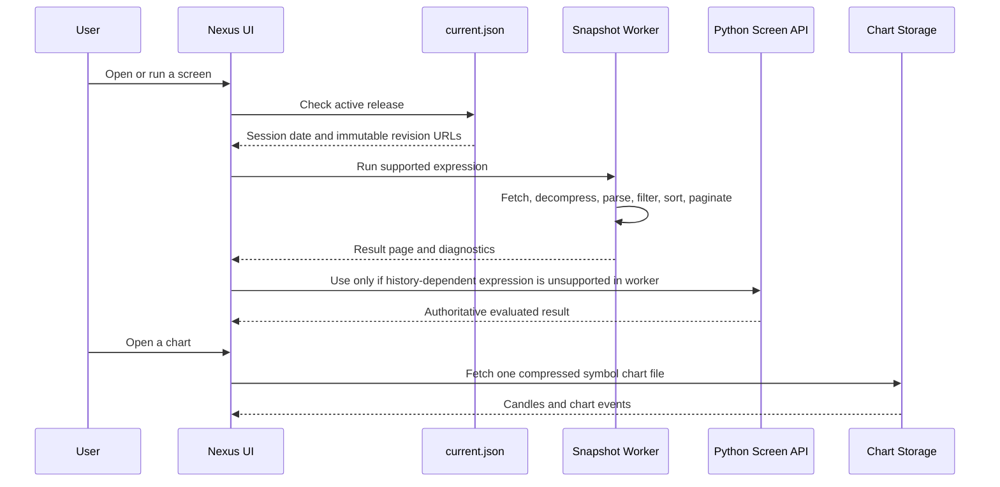
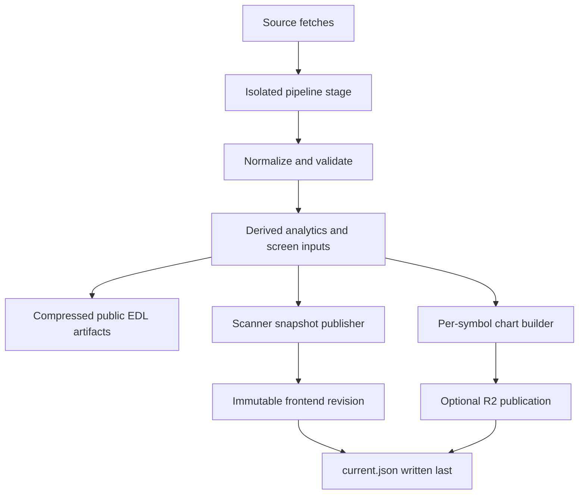

# Nexus Scanner

Nexus Scanner is an NSE equity research and screening system. It contains a React browser application, a Python market-data pipeline, immutable scanner releases, and optional Cloudflare R2 chart delivery.

Every result is tied to one published trading session and one immutable revision. The system does not silently combine a new stock snapshot with an old IPO catalogue, chart file, or filter result.

> Nexus Scanner is for research and data-engineering workflows. It is not investment advice. Upstream market data can be delayed, incomplete, corrected, rate-limited, or unavailable.

## Contents

- [What users can do](#what-users-can-do)
- [Every scanner form and filter family](#every-scanner-form-and-filter-family)
- [What happens at runtime](#what-happens-at-runtime)
- [How every published file is generated](#how-every-published-file-is-generated)
- [Storage, caching, and R2](#storage-caching-and-r2)
- [Local development](#local-development)
- [Automated refreshes](#automated-refreshes)
- [Testing, data quality, and limits](#testing-data-quality-and-limits)

## Repository map

| Location | Responsibility |
| --- | --- |
| [`frontend/`](frontend/) | React 19 UI, TypeScript types, Vite server/build, browser screening worker, chart client, and frontend tests. |
| [`DO NOT DELETE EDL PIPELINE/`](DO%20NOT%20DELETE%20EDL%20PIPELINE/) | Python acquisition, history maintenance, calculations, condition engine, artifact validation, and publication. The directory name is preserved because existing workflows use it. |
| [`.github/workflows/daily_refresh.yml`](.github/workflows/daily_refresh.yml) | Weekday refresh, tests, scanner publication, R2 upload when configured, and generated-data commit. |
| [`.github/workflows/weekly_eod2_refresh.yml`](.github/workflows/weekly_eod2_refresh.yml) | Weekly adjusted-history overlay followed by the same validated publication flow. |
| [`docs/r2-chart-publication.md`](docs/r2-chart-publication.md) | R2 object layout, retry behavior, retention, and chart fields. |
| [`frontend/README.md`](frontend/README.md) | Frontend API details and local UI development. |

## What users can do

### Mainboard screener

The mainboard workspace has four ways to begin a screen:

1. Choose a built-in scan.
2. Add custom conditions through the visual filter builder.
3. Write an NQL query, which is compiled into the same expression tree.
4. Apply conditions to a pasted custom symbol list.

Users choose a universe, build nested `AND` or `OR` rules, run the screen, sort the common results table, paginate, copy symbols, save a screen locally, and open a chart. The standard universes are Mainboard, Nifty 50, Nifty 500, MidSmall 400, and a validated custom symbol list.

### IPO catalogue

The IPO view uses the same compact table system: search, filters, sorting, page controls, and a listing window. It is an IPO catalogue first; filters are applied to the released IPO dataset and current snapshot fields. Listing date, issue/listing prices, current price, return since listing, turnover, market cap, delivery, sector, and industry appear only when the published source supplies them.

### Symbol screener

The symbol form accepts pasted tickers, normalizes them, reports invalid symbols, and produces a private custom universe for the same screen engine. It does not invent matches for unknown symbols.

### Saved preferences

Saved screens and UI preferences are browser-local state. They are not uploaded to the market-data pipeline and do not change the public scanner release.

## Every scanner form and filter family

The filter catalog is a typed contract. A condition has a name, documented inputs, evaluation rules, and availability requirement. The client renders its form from this contract, and the Python evaluator uses the same condition identifiers.

### Trend and moving-average filters

| Condition | What it evaluates |
| --- | --- |
| Persistent Momentum | Price persistence above or below selected EMAs with the configured reset rule. |
| Price vs EMA / Price vs SMA | Latest close relative to the selected EMA or SMA. |
| EMA Shakeout & Reclaim | A recent dip through an EMA followed by a current reclaim. |
| MA Stack / Moving Average Stack Order | Ordered moving averages such as 20 above 50 above 200. |
| % Days Above MA | Share of a selected lookback spent above a selected moving average. |
| MA Slope / MA Slope & Trajectory | Direction and percentage movement of a moving average across its lookback. |
| EMA Key Level Reclaim | Recent EMA violation followed by a reclaim. |
| Consecutive Up Days | A run of positive-close sessions. |

### Price, volatility, range, and chart-pattern filters

| Condition | What it evaluates |
| --- | --- |
| Price Change % | Return across a trading-session window. A legacy `Below` request is interpreted as a decline of at least the threshold. |
| New High / New Low | Highest high or lowest low over a complete rolling lookback, optionally fired recently. |
| % From 52-Week High / Low | Latest close distance from the high or low over up to 252 sessions. |
| All-Time-High distance | Split- and bonus-adjusted distance from all available EOD history. |
| ATR % / ADR % | Wilder ATR or average daily high-low range as a percentage of price. |
| Consolidation Range | High-low range of a completed base. |
| Range Contraction / VCP | Relative contraction of recent and prior ranges or swing legs. |
| Inside Bar | Daily or weekly bars contained by preceding bars. |
| Unfilled Gap | Up or down gaps that have remained open or have filled. |
| Horizontal Resistance | Unbroken clustered swing-high resistance near the current base. |
| Gap Up / Gap Down | Session gaps relative to the prior close. |

### Volume, liquidity, delivery, and trading controls

| Condition | What it evaluates |
| --- | --- |
| RVOL / Volume vs Average | A session's volume relative to its preceding average-volume window. |
| Volume Trend | Recent volume compared with a prior base window. |
| Highest Volume in N Days | A high-volume event in its completed lookback. |
| Average Turnover | Average traded value in crore across a daily lookback. Intraday windows require intraday history. |
| Delivery % Spike | Delivery percentage against aligned delivery history. |
| Market Cap / Free-Float Market Cap | Current capitalisation and free-float-adjusted capitalisation. |
| Price Range / Circuit Band | Current close range and NSE price-band constraints. |
| F&O Ban / Series | Current official ban state and NSE listing series. |
| Exclude ASM / GSM | Latest available surveillance lists, including stage and fetch date. |

### Relative strength, breadth, and universe filters

| Condition | What it evaluates |
| --- | --- |
| Relative Strength | Stock return minus benchmark return over aligned sessions. |
| RS Line at New High | Relative-strength line at its lookback high while price remains below its own high. |
| RS Rating | Cross-sectional 1–99 percentile across the published eligible universe. |
| Index Membership | Published current index membership. |
| Market Breadth | Published breadth metrics for the supported universe and session. |
| Sector / Industry | Current published NSE classifications. |
| Listing Age | Trading sessions since listing. |

### Fundamental and earnings filters

| Condition | What it evaluates |
| --- | --- |
| P/E | Positive trailing P/E from the released fundamental snapshot. |
| Quarterly growth | QoQ or YoY revenue, net profit, PBT, EPS, or operating-margin growth. |
| Fundamental metric | ROE, ROCE, operating margin, debt to equity, PEG, or five-year sales growth when supplied. |
| EPS Last Year Higher | Latest annual EPS compared with the preceding annual EPS. |
| Days Since Earnings | Trading sessions since the latest reported earnings event. |

### Built-in scans

The versioned local preset library contains 45 scans, including Persistent Momentum, Easy Money, Relative Strength Leaders, RS Line at New High, Stage 2 Uptrend, Momentum Burst, Quiet Strength, 52-Week High Breakout, 20-Day High on Record Volume, Breakout from Tight Base, Pocket Pivot, ADX Trend Breakout, Circuit-Safe Breakout, VCP Contraction, Inside Bar Coil, Weekly Inside Bar, Volume Dry-Up Base, Flat Base, Horizontal Resistance, Flags & Pennants, Low-ATR Coil, 21 EMA Pullback, 50 EMA Shakeout, Higher-Low Pullback, Gap Support Retest, Volume Surge, Highest Volume in 3 Months, Delivery-Backed Accumulation, Sustained Accumulation, Unfilled Gap Up, Gap & Go, Gap Down Washout, 52-Week Low Bounce, RS Divergence Turn, Relative Weakness, Earnings Growth Momentum, Post-Earnings Drift, Growth at a Fair Price, Revenue & Profit Acceleration, Pre-Earnings Coil, Breadth-Gated Leaders, Liquid Trading Universe, Fresh IPO Base, Nifty 500 Momentum, and Midcap Breakout.

Preset defaults deliberately include market cap above ₹1,000 Cr, price above ₹10, and 50-day average turnover above ₹5 Cr. They have no upper market-cap or price ceiling and no blanket 2% or 5% circuit exclusion.

## What happens at runtime



### Browser release loading

1. The app loads `frontend/public/data/current.json` and validates its revision and session metadata.
2. It resolves the immutable `stocks.json.gz` URL when browser decompression is available, otherwise the JSON URL.
3. A persistent module worker fetches the snapshot with cache reuse, decompresses it, validates its revision/session/row count, and retains at most a small number of revisions.
4. The worker evaluates supported conditions against precomputed values, then returns only the requested result page rather than all matching rows.
5. Changing pagination reuses the matching and sorted set. Changing filters, universe, symbols, or sort recalculates the set.
6. An unsupported custom expression falls back to the Python `/screens/run` service, pinned to the same revision and session.

The main UI never claims a browser-only approximation is a result for a rule that needs the Python history engine.

### Browser charts

Opening a symbol chart does not load chart data for every stock. The chart client requests one immutable compressed payload using the chart URL template in the release. It verifies the symbol and session before displaying it.

### Runtime files

| File or path | Runtime use |
| --- | --- |
| `frontend/public/data/current.json` | Small active-release pointer. Revalidate frequently. |
| `frontend/public/data/revisions/<revision>/stocks.json.gz` | Compressed stock snapshot used by the worker. |
| `frontend/public/data/revisions/<revision>/stocks.json` | Compatibility snapshot for clients without compressed loading. |
| `frontend/public/data/revisions/<revision>/ipos.json` | Immutable IPO catalogue for that release. |
| `frontend/public/data/revisions/<revision>/release.json` | Revision metadata retained for an open historical release. |
| `daily/<session>/<chart-revision>/charts/<symbol>.json.gz` in R2 | One on-demand chart payload per symbol. |

## How every published file is generated



### 1. Source collection

The EDL pipeline collects public NSE archive data, Dhan ScanX/web data, official delivery files, corporate actions, filings, announcements, index data, F&O information, surveillance lists, and market data needed for the selected refresh. Source availability is not assumed: failed required stages stop publication.

### 2. History maintenance

The pipeline maintains local OHLCV, index OHLCV, delivery, scanner-history, and filing-history caches. Weekday refreshes add official recent data. The weekly workflow overlays available EOD2 adjusted history so longer lookbacks can be retained without downloading full history on every weekday run.

### 3. Normalization and calculations

The pipeline standardizes securities and calculates:

- Mainboard eligibility, listing metadata, market cap, classifications, and current tradability fields.
- OHLCV-derived moving averages, returns, RVOL, turnover, highs/lows, ATR/ADR, gaps, and pattern inputs.
- Relative-strength and breadth datasets with aligned benchmark sessions.
- Fundamental, earnings, shareholding, delivery, corporate-action, surveillance, F&O, and IPO artifacts.
- Data-quality and universe-reconciliation reports.

### 4. Artifact validation and promotion

The full refresh runs in an isolated temporary stage. It validates schema, required fields, counts, freshness, and cross-artifact dates before promotion. A failed stage or quality check leaves the previously published public files unchanged.

### 5. Browser snapshot publication

`frontend/publish_snapshot.py` reads validated EDL artifacts, calculates the browser-safe metrics and preset results, freezes local Python inputs for custom evaluations, and creates a content-hash revision.

It writes immutable revision files first, verifies the release, and writes `current.json` last. A same-session correction therefore gets a new immutable revision rather than overwriting an earlier result.

### 6. Chart generation and R2 upload

The chart builder runs before temporary news and filings directories are removed. It creates one compressed JSON payload per symbol, validates the chart index, payload symbol, session, and content revision, then uploads immutable objects to R2 when configuration is complete.

### Generated public artifacts

| Artifact | Contents |
| --- | --- |
| `all_stocks_fundamental_analysis.json.gz` | Canonical stock snapshot and published fundamental fields. |
| `sector_analytics.json.gz` | Sector and industry analytics. |
| `market_breadth.json.gz` / `market_breadth_v2.json.gz` | Current and historical breadth outputs. |
| `breadth_universe_snapshot.json.gz` | Fixed eligible universe used for breadth and RS calculations. |
| `all_indices_history_v2.json.gz` / `all_indices_list.json` | Published index metadata and history. |
| `corporate_action_ledger.json.gz`, `nse_corporate_actions.json.gz` | Corporate-action data used by published features and charts. |
| `nse_fno_ban.json.gz`, `rs_rating_daily.json.gz` | F&O ban and daily RS-rating artifacts. |
| `ipo_screener.json.gz` | IPO catalogue source. |
| `shareholding_history.json.gz`, `quarterly_financial_history.json.gz` | Published historical shareholding and financial records. |
| `data_quality.json`, `mainboard_universe_report.json`, `nse_universe_reconciliation.json` | Quality, universe, and reconciliation diagnostics. |
| `pipeline_report.json` | Release execution and final-validation report, generated on each successful pipeline run. |

## Storage, caching, and R2

| Data | Where it lives | Why |
| --- | --- | --- |
| Source code and compact public scanner releases | Git | Reviewable application and immutable browser release history. |
| Current browser pointer | Git/static host | Small release authority for the frontend. |
| Per-symbol chart payloads | Cloudflare R2 | On-demand delivery without growing Git history by every chart revision. |
| Raw OHLCV, delivery, and filing caches | Local workspace and GitHub Actions cache | Fast incremental pipeline runs. |
| Long-term raw-history backup | Private R2 backup, planned | Recovery when an Actions cache is evicted. |
| Saved screens and preferences | Browser local storage | User-local state without a server account. |

GitHub Actions cache is an accelerator, not durable data storage. It may be evicted. Raw-history recovery should come from the planned private backup, not from an assumed cache hit.

### R2 behavior

R2 configuration is controlled by:

```text
EDL_CHART_STORAGE=r2
R2_ACCOUNT_ID
R2_ACCESS_KEY_ID
R2_SECRET_ACCESS_KEY
R2_PUBLIC_BASE_URL
R2_BUCKET=nexus-screener-chart-data
```

When one of the required R2 settings is absent, the scanner release still publishes without chart URLs and logs the missing settings. When all settings are present, an upload, verification, retention, or archive failure stops publication and preserves the previous active release.

R2 retention is:

- Daily chart revisions: 90 calendar days.
- Month-end chart revisions: retained indefinitely.
- The first successful release of a new month archives the prior month’s latest successful session.

See [`docs/r2-chart-publication.md`](docs/r2-chart-publication.md) for the object layout and lifecycle details.

## Local development

### Prerequisites

- Python 3.9 or later.
- Node.js and npm compatible with `frontend/package-lock.json`.
- `rclone` only if directly testing an R2 upload.

### Pipeline setup

```bash
cd "DO NOT DELETE EDL PIPELINE"
python3 -m venv .venv
source .venv/bin/activate
pip install -r requirements.txt

python3 -m unittest discover -s tests -v
python3 -m compileall -q .
```

Run the complete pipeline when you intend to refresh local market files:

```bash
python3 run_full_pipeline.py
```

Diagnostic mode skips the OHLCV refresh and never promotes a new public release:

```bash
EDL_FETCH_OHLCV=0 python3 run_full_pipeline.py
```

### Publish local browser data

From the repository root, after a validated pipeline run:

```bash
python3 frontend/publish_snapshot.py
```

### Start the frontend

```bash
cd frontend
npm install
npm run dev -- --host localhost --port 8080 --strictPort
```

Open [http://localhost:8080](http://localhost:8080).

For local custom history conditions, Vite uses the Python bridge. A static production deployment must supply a backend for `POST /screens/run` or proxy `/api/screens/run` to that backend.

```env
VITE_USE_MOCK=false
VITE_API_BASE_URL=https://screener-api.nexusjournal.co.in/v1
```

`VITE_USE_MOCK=true` is only for UI development. It is not live market data.

## Automated refreshes

### Daily weekday workflow

At 16:00 IST, Monday through Friday, the daily workflow restores available caches, runs the Python and scanner-publication tests, refreshes market inputs, calculates artifacts, publishes the browser snapshot, optionally uploads charts, and commits validated generated files.

### Weekly adjusted-history workflow

At 09:00 IST each Sunday, the weekly workflow restores its history caches, updates the EOD2 adjusted-history checkout, overlays the long-history inputs, runs the same validation and publication sequence, and commits the result.

Both workflows use the same concurrency group. A daily release cannot race a weekly release.

## Testing, data quality, and limits

### Commands

```bash
# EDL pipeline tests
cd "DO NOT DELETE EDL PIPELINE"
python3 -m unittest discover -s tests -v

# Browser snapshot and R2 publication tests
cd ..
python3 -m unittest discover -s frontend -p 'test_*.py' -v

# Frontend tests and production build
cd frontend
npm test
npm run build
```

### Match states

| State | Meaning |
| --- | --- |
| Match | All required inputs were available and the rule passed. |
| No match | All required inputs were available and the rule failed. |
| Unavailable | A required input was missing, insufficient, stale, or misaligned to the screen session. |

Unavailable is a deliberate result. It is used for missing OHLCV history, insufficient moving-average warmup, delivery gaps, unavailable historical snapshots, absent index membership, stale financial data, and unsupported intraday history. It never becomes a positive match.

### Important limits

- Historical technical screening needs local OHLCV history aligned to the requested session.
- Intraday turnover modes remain unavailable until intraday history is collected.
- Historical values for current-only fields, such as classification or P/E, cannot be reconstructed from a future snapshot.
- Data sources can change format or fail; a successful code test does not prove a particular upstream source returned complete live data.
- R2 charts are absent from scanner-only releases when R2 is not configured.

Read [`DO NOT DELETE EDL PIPELINE/docs/DATA_LIMITATIONS.md`](DO%20NOT%20DELETE%20EDL%20PIPELINE/docs/DATA_LIMITATIONS.md) and [`DO NOT DELETE EDL PIPELINE/docs/PIPELINE_INTEGRITY.md`](DO%20NOT%20DELETE%20EDL%20PIPELINE/docs/PIPELINE_INTEGRITY.md) before operating a live refresh.

## Further reading

- [Pipeline guide](DO%20NOT%20DELETE%20EDL%20PIPELINE/README.md)
- [Trend condition engine](DO%20NOT%20DELETE%20EDL%20PIPELINE/docs/TREND_CONDITION_ENGINE.md)
- [Market breadth methodology](DO%20NOT%20DELETE%20EDL%20PIPELINE/docs/BREADTH_METHODOLOGY.md)
- [NSE delivery data](DO%20NOT%20DELETE%20EDL%20PIPELINE/docs/NSE_DELIVERY_DATA.md)
- [R2 chart publication](docs/r2-chart-publication.md)
- [Frontend guide](frontend/README.md)
- [Contribution guide](CONTRIBUTING.md)

## License

[MIT](LICENSE)
